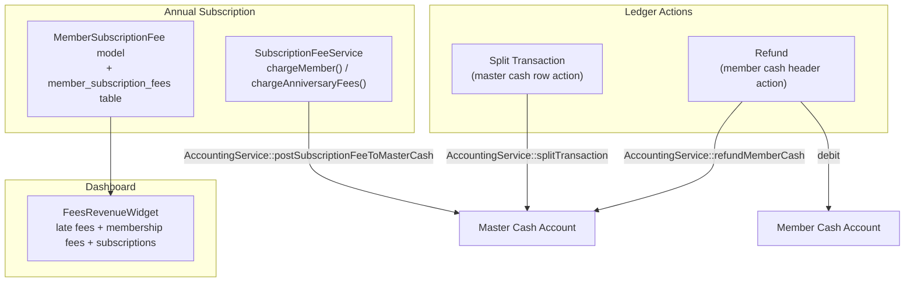

# Split / Refund / Annual Subscription & Fee Dashboard

## Architecture Overview



---

## 1 — Database Migration

**New file**: `database/migrations/<timestamp>_create_member_subscription_fees_table.php`

Columns:
- `id`, `member_id` FK, `year` (smallInt unsigned)
- `amount` decimal(15,2), `paid_at` datetime, `notes` text nullable
- `account_transaction_id` nullable FK → `account_transactions`
- `posted_by` FK → `users`
- `timestamps`, `softDeletes`
- `UNIQUE(member_id, year)` — one subscription per member per year

---

## 2 — New Model

**`app/Models/MemberSubscriptionFee.php`**

- `$fillable`, `$casts` (amount, paid_at)
- Relationships: `member()`, `postedBy()`, `accountTransaction()`
- Scope: `whereYear()`

---

## 3 — AccountingService additions

[`app/Services/AccountingService.php`](app/Services/AccountingService.php)

```php
// Split a master-cash entry into N labelled parts (net balance effect = 0)
public function splitTransaction(AccountTransaction $original, array $parts): void;

// Debit both member cash and master cash (refund to member)
public function refundMemberCash(Account $memberCash, float $amount, string $description, ?Member $member = null, ?CarbonInterface $at = null): void;

// Credit master cash for annual subscription fee
public function postSubscriptionFeeToMasterCash(MemberSubscriptionFee $fee): void;
```

`splitTransaction` logic:
1. Validate `sum($parts.amount) == $original->amount` (within 0.01 tolerance)
2. DB transaction: `safeDeleteAccountTransaction($original)` then `postEntry()` for each part, preserving `transacted_at` and `member_id` from the original

`refundMemberCash` logic:
- Validates account type is `member_cash` and `amount <= $memberCash->balance`
- DB transaction: debit member cash + debit master cash, both described as `"Refund — {name} — {desc}"`

---

## 4 — SubscriptionFeeService

**New**: `app/Services/SubscriptionFeeService.php`

- `chargeMember(Member $member, int $year, float $amount, string $notes = ''): MemberSubscriptionFee`
  - Creates `MemberSubscriptionFee` row, calls `AccountingService::postSubscriptionFeeToMasterCash()`
  - Throws if duplicate `(member_id, year)`
- `chargeAnniversaryFees(Carbon $today): int` (for scheduler — charges members whose `joined_at` month/day = today)

---

## 5 — Split Transaction action

[`app/Filament/Admin/Resources/AccountResource/RelationManagers/TransactionsRelationManager.php`](app/Filament/Admin/Resources/AccountResource/RelationManagers/TransactionsRelationManager.php)

Row action `splitTransaction` — visible only when `$this->getOwnerRecord()->type === Account::TYPE_MASTER_CASH`:

- Modal shows original amount (read-only info) and a `Repeater` (min 2 rows) with per-row:
  - `category` Select: Contribution | Late Fee | Membership Fee | Annual Subscription | Other
  - `description` TextInput (auto-prefilled from category, editable)
  - `amount` Numeric
- Live total `Placeholder` showing running sum vs original
- Submit validation: sum must equal original amount

---

## 6 — Refund action

Same [`TransactionsRelationManager.php`](app/Filament/Admin/Resources/AccountResource/RelationManagers/TransactionsRelationManager.php)

Header action `refundMemberCash` — visible only when `$this->getOwnerRecord()->type === Account::TYPE_MEMBER_CASH`:

- Fields: `amount` (pre-filled with current balance, editable ≤ balance), `description`, `transacted_at`
- On submit: calls `AccountingService::refundMemberCash()`
- Success notification: `"Refund of SAR :amount posted for :name"`

---

## 7 — Annual Subscription admin UI

**On `MemberResource`** [`app/Filament/Admin/Resources/MemberResource.php`](app/Filament/Admin/Resources/MemberResource.php):
- Record action (view page): `Charge Annual Subscription` — year select (default current year), amount (pre-filled from `Setting::annualSubscriptionFee()`), notes
- Bulk action on list page: same

**Settings**: Add `Setting::annualSubscriptionFee(): float` helper using key `subscription.annual_fee`.  
Surface the setting on `app/Filament/Admin/Pages/SystemSettingsPage.php` under the existing contributions/fees tab.

---

## 8 — Scheduler hook

`app/Console/Kernel.php` — add `$schedule->call(fn() => app(SubscriptionFeeService::class)->chargeAnniversaryFees(today()))->dailyAt('06:00')` (charges on anniversary date each year).

---

## 9 — Fee Revenue Dashboard Widget

**New widget**: `app/Filament/Admin/Widgets/FeesRevenueWidget.php`  
**New view**: `resources/views/filament/admin/widgets/fees-revenue.blade.php`

`getData()` queries:
- Late fees this year / all-time: `Contribution::sum('late_fee_amount')` + `LoanInstallment::sum('late_fee_amount')` with/without `whereYear`
- Membership fees this year / all-time: `MembershipApplication::whereNotNull('membership_fee_posted_at')->sum('membership_fee_amount')` with/without `whereYear`
- Subscription fees this year / all-time: `MemberSubscriptionFee::sum('amount')` with/without `whereYear`

View design: 3-column card row (Late Fees · Membership Fees · Subscription Fees), each card with:
- Icon + colour-coded bar
- All-time total (large)
- "This year: SAR X" sub-line
- Count badge

Register in [`app/Providers/Filament/AdminPanelProvider.php`](app/Providers/Filament/AdminPanelProvider.php) at sort order after `FundHealthWidget`.

---

## 10 — Translation

Add Arabic keys to `lang/ar.json`:
- `"Split Transaction"`, `"Split into parts"`, `"Running total"`, `"Parts must sum to original amount"`
- `"Refund"`, `"Post Refund"`, `"Refund of SAR :amount posted for :name"`
- `"Annual Subscription"`, `"Annual Subscription Fee"`, `"Charge Annual Subscription"`, `"Subscription already recorded for :year"`
- `"Fee Revenue"`, `"Late Fees"`, `"Subscription Fees"`, `"This year"`, `"All-time"`, `"No fees recorded yet"`
